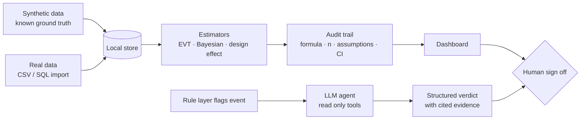
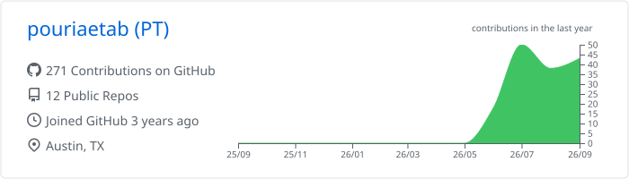
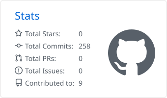
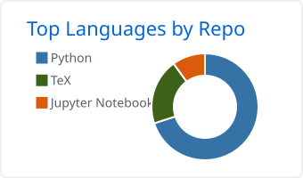

<div align="center">


</div>

---

### About me

```yaml
focus      : statistics · data science · business · product
degree     : M.S. Statistics (Data Science concentration)
experience : autonomous driving · automation · analytics
base       : Austin, TX · open to relocation
status     : open to new opportunities
```

- 📊 I turn messy data into clear reports and decisions people can act on
- ⚙️ I build lightweight web apps and automations that take manual work off people's plates
- 📄 Two open access statistics preprints, each archived on Zenodo with a DOI
- 🤝 I build with Claude Code as my pair programmer. I frame the problem, choose the statistics, and verify the results

---

<!-- PINNED:START -->
### Pinned

<table>
<tr>
<td width="50%" valign="top">
<a href="https://github.com/pouriaetab/glassbox"><b>📌 glassbox</b></a><br>
<sub>A statistical decision pipeline with its validation, risk gates and failure history rendered live. Built as an engineering demonstration; the measured result is negative.</sub><br><br>

</td>
<td width="50%" valign="top">
<a href="https://github.com/pouriaetab/av-fleet-evt"><b>📌 av-fleet-evt</b></a><br>
<sub>Generation-aware extreme value estimation for AV flet safety validation under heterogeneous sensor-genertion detection floors. Methods paper plus synthetic imulation.</sub><br><br>

</td>
</tr>
</table>

---
<!-- PINNED:END -->

### Experience highlights

**🚛 TuSimple** · Autonomous trucking · 2020 to 2023

*Performance Ops Analyst / Operations Data Scientist / SQA / Annotator*

- Classified and verified driving events from the autonomous truck fleet
- Built Looker dashboards and SQL queries that turned data from several internal sources into clear, decision ready reports
- Streamlined KPI reporting and improved the accuracy of software quality metrics
- Onboarded new hires and pushed for automation in manual review work

**💼 Independent Consultant** · 2023 to present

- Help small business owners across a variety of sectors organize their data and automate repetitive work
- Build lightweight web apps that pull scattered data into one place and streamline how it flows through the business
- Create clear, informative reports that turn raw numbers into decisions owners can act on
- Automate recurring reporting and data cleaning so owners can run their own numbers without redoing spreadsheets by hand

---

### More projects

<details>
<summary><b>Statistics research, AV safety tools, and quant tooling</b></summary>

<br>

| Project | What it does |
|:--|:--|
| 📄 **[av-clustered-rates](https://github.com/pouriaetab/av-clustered-rates)** [](https://doi.org/10.5281/zenodo.22646556) | Preprint on clustered events and the effective sample size in fleet rate estimation, using real California DMV filings across twelve fleets. |
| 🛡️ **[av-safety-workbench](https://github.com/pouriaetab/av-safety-workbench)** | Risk assessment workbench where every number carries its method, assumptions, uncertainty and data source. Python + React, runs fully local, 86 tests. |
| 🤖 **[av-safety-triage-agent](https://github.com/pouriaetab/av-safety-triage-agent)** | LLM agent that investigates flagged events with read only tools and proposes a severity for human review, scored against hidden ground truth. |
| 📊 **[quantdesk](https://github.com/pouriaetab/quantdesk)** | Trading workstation that runs locally: signal engine, event driven backtester, and a risk manager with daily loss limits and a kill switch. |
| 🔁 **[looper](https://github.com/pouriaetab/looper)** | Rules based swing trading assistant that fuses a technical timing engine with a fundamental scorecard into one explained stance. |
| 🧪 **[trade_genai](https://github.com/pouriaetab/trade_genai)** | Local research notebook: ask in plain English, a live Python kernel runs it on market data, and ideas graduate into repeatable pipelines. |
| 🧰 **[ds-toolkit](https://github.com/pouriaetab/ds-toolkit)** · **[automate-eda](https://github.com/pouriaetab/automate-eda)** | Notebooks on statistical methods, ML and NLP, and a tool that generates EDA notebooks automatically. |

</details>

---

### In the lab (private builds)

- **Levels and flow workstation.** Per price level: touch probability from a closed form barrier model blended with historical counts by empirical Bayes, strengthening vs weakening from a Beta-Binomial posterior, and move size from a peaks over threshold GPD. A live audit tab shows each formula, its hyperparameters and assumption tests.
- **Control deck.** One local launcher that starts, stops and assigns ports to all my webapps so they never collide.

---

### How I design systems



1. No number without its sample size and its uncertainty.
2. When the evidence is thin, say "insufficient evidence" instead of guessing.
3. Deterministic rules decide what counts. LLMs investigate and explain. People sign off.
4. Test on synthetic data with known answers before trusting real data.
5. Local first. Nothing leaves the machine unless it has to.

---

### Tech stack

**Languages**
<br>


**Statistics and ML**
<br>


**Apps, data and AI**
<br>


**Tools**
<br>


---

### GitHub activity

<div align="center">

<picture>
  <source media="(prefers-color-scheme: dark)" srcset="./profile-summary-card-output/github_dark/0-profile-details.svg">
  
</picture>

<picture>
  <source media="(prefers-color-scheme: dark)" srcset="./profile-summary-card-output/github_dark/3-stats.svg">
  
</picture>
<picture>
  <source media="(prefers-color-scheme: dark)" srcset="./profile-summary-card-output/github_dark/1-repos-per-language.svg">
  
</picture>


<picture>
  <source media="(prefers-color-scheme: dark)" srcset="https://raw.githubusercontent.com/pouriaetab/pouriaetab/output/github-snake-dark.svg">
  
</picture>

</div>

---

### Currently exploring

- Sequential (SPRT style) stopping rules for AV test mileage, as an alternative to fixed mileage targets
- Carrying rare event estimators from aviation and medicine into AV validation
- Testing the generation aware EVT estimator on real fleet data

```python
pt = {
    "motto"      : "A point estimate without its caveat is a liability.",
    "first_rule" : "Known ground truth first, real data second.",
    "side_quest" : "Turning trading statistics into AV safety methods",
    "fuel"       : "Coffee and the opening bell",
}
```
